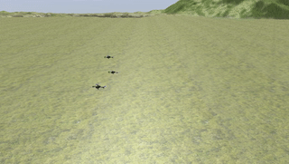
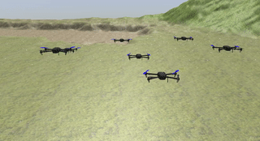

<h2 align="center">
  <br> MagicFlock <br>
</h2>

[](https://www.gnu.org/licenses/old-licenses/gpl-2.0.en.html)

MagicFlock is an easy to use simulation platform for quadrotors. MagicFlock is a library that intended to make quadrotors simulator easy in Gazebo simulator.
MagicFlock has intuitive and simple interface that allows researcher to test algorithms on several quadrotors by writing only several lines of code.
In additions, the library has a set of simple examples that can be use a tutorial in order to create and simulate you swarm.

MagicFlock differs from other libraries by the following:

* It has no dependencies on ROS
* Support data driven approaches: such as iterative learning or Reinforcement learning
* Simple and intuitive interface
* Can be used in Reinforcement learning context
* Easy to install and to maintain (small amount of dependencies)

After installing MagicFlock, a set of examples can be found in `examples\` folder.
A generic example is provided as starter guide to understand the basic simulation principle.
All examples are documented on gitbook, can be found here.
Examples implement the algorithm needed to maintain a swarm of quadrotors from
taking off until landing. In addition, to maintain the swarm intact as
long as possible.




### Dependencies
``` 
Gazebo >= 8
mlpack > 3.4 (for machine learning examples)
CMake >=3.10
Armadillo > 8.400
```

### Installation
If you have Gazebo and all other dependencies installed:

```
git clone https://github.com/shrit/MagicFlock.git
cd MagicFlock
git submodule update --init --recursive
mkdir build
cmake ../
make -j8
sudo make install
```
* Full documentation can be found here including full installation guide
Please refer to our installation guide, to install the libraries and its dependencies.

### Paper and video 
If you are using IL4MRC in your research, please cite the following paper, can
be found here:
```

```

### Contribution
The library still in early stage development with no release yet. Contributions are
very welcomed, please do not hesitate in opening issues for problem, or a
sending pull request for any thoughtful ideas. Contribution guide can be
found here.

### License

This project is licensed under GPL license [GNU GPL v2.0](https://choosealicense.com/licenses/gpl-2.0/)

